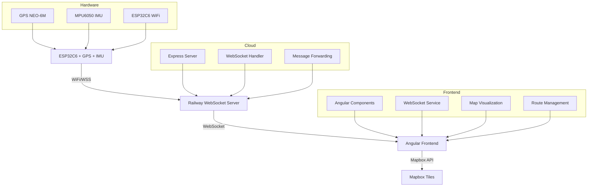
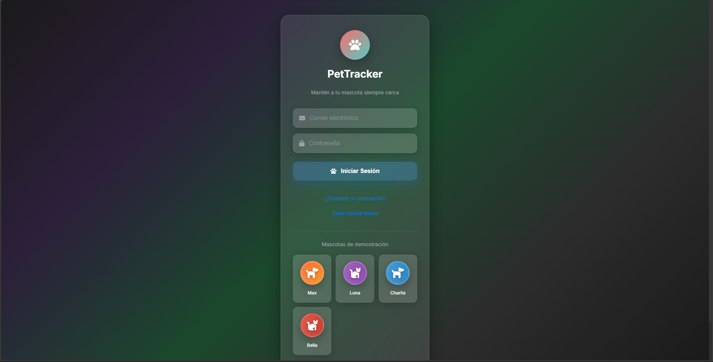
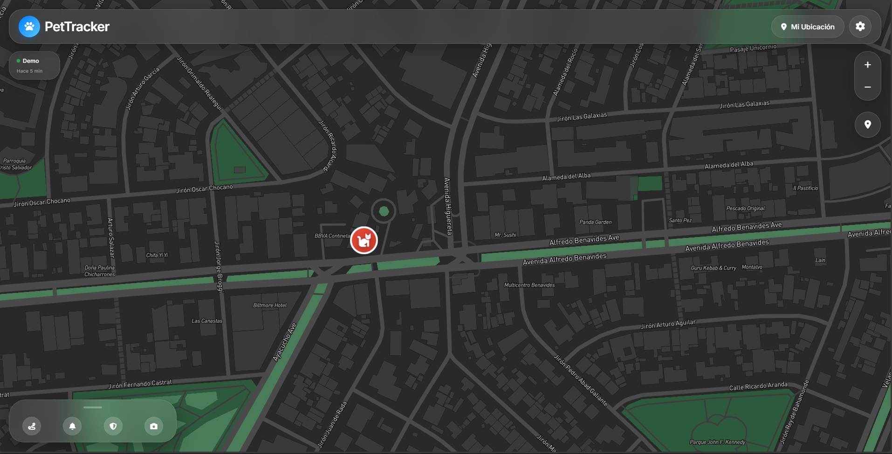
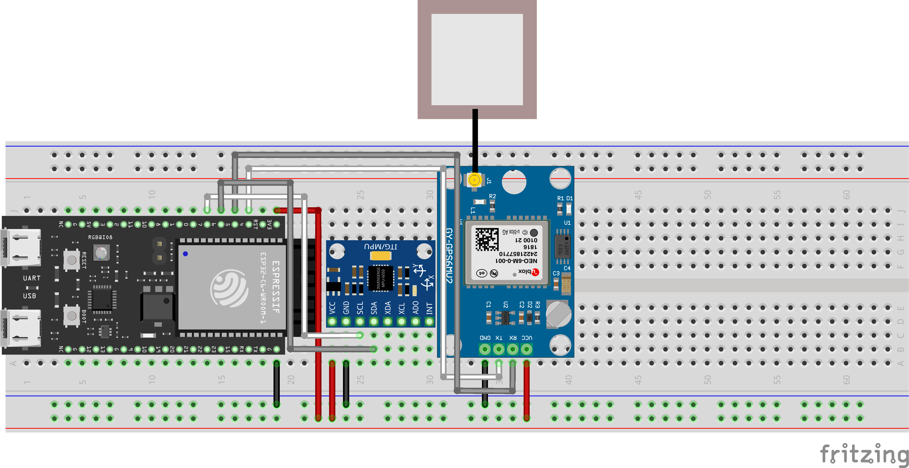
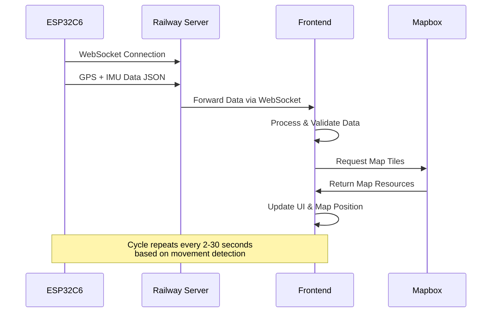

# 🐾 Pet Tracker - Sistema Inteligente de Rastreo GPS + IMU

<div align="center">
  
  
  <p><strong>Sistema integral de seguimiento en tiempo real para mascotas con tecnología IoT avanzada</strong></p>
  <p><strong>🚂 Optimizado para Railway Deployment</strong></p>
  
  
  
  
  
  
  
  
  <br>
  
  [](https://pet-tracker-production.up.railway.app)
  [](./esp32c6/)
  [](LICENSE)
</div>

---

## 🚂 Railway Deployment

**Este proyecto está específicamente configurado para Railway y no debe ejecutarse localmente.**

### 📡 URLs de Producción
- **Frontend**: `https://pet-tracker-production.up.railway.app/`
- **WebSocket**: `wss://pet-tracker-production.up.railway.app/ws`
- **Health Check**: `https://pet-tracker-production.up.railway.app/health`

### 🎯 ESP32C6 Configuration
El ESP32C6 está configurado para conectarse directamente a Railway:
```cpp
const char* WS_HOST = "pet-tracker-production.up.railway.app";
const int WS_PORT = 443;
const char* WS_PATH = "/ws";
```

---

## 📖 Índice

- [🎯 Descripción General](#-descripción-general)
- [✨ Características Principales](#-características-principales)
- [🏗️ Arquitectura del Sistema](#️-arquitectura-del-sistema)
- [📱 Capturas de Pantalla](#-capturas-de-pantalla)
- [🔧 Tecnologías Utilizadas](#-tecnologías-utilizadas)
- [📦 Estructura del Proyecto](#-estructura-del-proyecto)
- [⚙️ Configuración e Instalación](#️-configuración-e-instalación)
- [🚀 Deployment](#-deployment)
- [📊 Flujo de Datos](#-flujo-de-datos)
- [🔒 Seguridad](#-seguridad)
- [📈 Características Avanzadas](#-características-avanzadas)
- [🤝 Contribuciones](#-contribuciones)

---

## 🎯 Descripción General

**Pet Tracker** es un sistema completo de rastreo y monitoreo para mascotas que combina hardware IoT avanzado con una aplicación web moderna. El sistema utiliza un **ESP32C6** equipado con GPS y sensores IMU para recopilar datos de ubicación y actividad en tiempo real, transmitiendo la información a través de WebSocket a una interfaz web desarrollada en **Angular 20**.

### 🌟 Propósito

Este proyecto fue diseñado para proporcionar a los dueños de mascotas una solución completa de monitoreo que permite:
- **Seguimiento en tiempo real** de la ubicación de su mascota
- **Análisis de actividad** basado en sensores IMU (acelerómetro y giroscopio)
- **Detección inteligente de movimiento** con intervalos de envío adaptativos
- **Historial de rutas** para analizar patrones de comportamiento
- **Interfaz moderna y responsive** accesible desde cualquier dispositivo

---

## ✨ Características Principales

### 🛰️ **Seguimiento GPS de Precisión**
- Ubicación en tiempo real con precisión de ±3 metros
- Validación automática de coordenadas GPS
- Manejo inteligente de pérdida de señal
- Ubicación de fallback (UPC Sede Monterrico) cuando no hay GPS

### 🧠 **Análisis Inteligente de Actividad**
- **Detección de estados**: reposo, caminando, corriendo, jugando, viajando
- **Sensores IMU**: Acelerómetro 3-axis + Giroscopio 3-axis (MPU6050)
- **Algoritmos adaptativos** que combinan datos GPS + IMU
- **Intervalos de envío inteligentes**:
  - 30 segundos cuando está quieto
  - 5 segundos durante movimiento normal
  - 2 segundos durante movimiento rápido

### 🗺️ **Visualización Avanzada**
- **Mapbox GL JS** para renderizado cartográfico profesional
- **Nombres de ubicación estilo Apple** (ej: "Miraflores, Lima" en lugar de coordenadas)
- **Trazado automático de rutas** durante movimiento
- **Marcadores personalizados** para inicio y fin de rutas
- **Controles de navegación** sin auto-centrado molesto

### 📡 **Comunicación en Tiempo Real**
- **WebSocket nativo** con latencia < 50ms
- **Reconexión automática** en caso de pérdida de conexión
- **Manejo de estado robusto** con validación de mensajes
- **Compresión de datos** para optimizar ancho de banda

### 🎨 **Interfaz Moderna**
- **Diseño Liquid Glass** con efectos de cristal y desenfoque
- **Responsive Design** optimizado para móvil y desktop
- **Animaciones fluidas** y transiciones suaves
- **Tema oscuro/claro** adaptativo

---

## 🏗️ Arquitectura del Sistema



### 📋 Componentes del Sistema

#### **Hardware (ESP32C6)**
- **Microcontrolador**: ESP32C6 con WiFi integrado
- **GPS**: NEO-6M para ubicación precisa
- **IMU**: MPU6050 (acelerómetro + giroscopio)
- **Alimentación**: Batería recargable con gestión de energía

#### **Backend (Railway)**
- **Servidor**: Express.js con soporte WebSocket
- **Infraestructura**: Railway Cloud Platform
- **Base de datos**: En memoria para datos en tiempo real
- **API**: RESTful endpoints + WebSocket real-time

#### **Frontend (Angular)**
- **Framework**: Angular 20 con TypeScript
- **Mapas**: Mapbox GL JS para visualización
- **Comunicación**: WebSocket nativo
- **Estado**: RxJS Observables para manejo reactivo

---

## 📱 Capturas de Pantalla

### 🔐 Pantalla de Login


La pantalla de login presenta un diseño moderno con efectos de cristal líquido y un formulario elegante para el acceso al sistema. Características destacadas:
- **Diseño Liquid Glass** con desenfoque y transparencias
- **Formulario responsive** que se adapta a diferentes tamaños de pantalla
- **Validación en tiempo real** de credenciales
- **Animaciones suaves** para una experiencia de usuario premium

### 🗺️ Interfaz Principal del Mapa


La interfaz principal del mapa muestra el sistema de rastreo en acción con todas las características integradas:

#### **Elementos Visuales Destacados:**

1. **🎯 Marcador de Mascota**
   - Ubicación en tiempo real con ícono personalizado
   - Popup informativo con datos de actividad
   - Indicador de estado de conexión ESP32C6

2. **📍 Información de Ubicación**
   - Nombres de lugares estilo Apple
   - Coordenadas precisas cuando sea necesario
   - Indicador de calidad de señal GPS

3. **📊 Panel de Estado**
   - Nivel de batería del dispositivo
   - Estado de actividad actual (reposo/movimiento)
   - Velocidad en tiempo real
   - Última actualización

4. **🛤️ Trazado de Rutas**
   - Líneas de ruta automáticas durante movimiento
   - Marcadores de inicio y fin de recorrido
   - Historial de rutas navegable

5. **⚙️ Controles de Navegación**
   - Zoom y pan sin interferencias
   - Botón para centrar en mascota
   - Controles de capa del mapa

---

## 🔧 Tecnologías Utilizadas

### **Frontend Technologies**
| Tecnología | Versión | Propósito |
|------------|---------|-----------|
| **Angular** | 20.x | Framework principal |
| **TypeScript** | 5.x | Lenguaje de programación |
| **Mapbox GL JS** | 3.x | Visualización de mapas |
| **RxJS** | 7.x | Programación reactiva |
| **SCSS** | - | Estilos avanzados |

### **Backend Technologies**
| Tecnología | Versión | Propósito |
|------------|---------|-----------|
| **Node.js** | 24.x | Runtime de servidor |
| **Express.js** | 4.x | Framework web |
| **WebSocket (ws)** | 8.x | Comunicación en tiempo real |
| **Railway** | - | Plataforma de deployment |

### **Hardware & Firmware**
| Componente | Modelo | Especificaciones |
|------------|---------|------------------|
| **Microcontrolador** | ESP32C6 | WiFi 6, Bluetooth 5, RISC-V |
| **GPS** | NEO-6M | Precisión 2.5m, 10Hz update |
| **IMU** | MPU6050 | 6-axis, 16-bit ADC |
| **IDE** | Arduino IDE | 2.x con librerías ESP32 |

### **DevOps & Tools**
- **Git** - Control de versiones
- **Railway** - CI/CD y hosting
- **Nixpacks** - Build system
- **VS Code** - Entorno de desarrollo

---

## 📦 Estructura del Proyecto

```
pet-tracker/
├── 📁 frontend/                    # Aplicación Angular
│   ├── 📁 src/
│   │   ├── 📁 app/
│   │   │   ├── 📁 components/      # Componentes reutilizables
│   │   │   │   ├── imu-monitor.component.ts
│   │   │   │   ├── pet-alerts.component.ts
│   │   │   │   ├── pet-history.component.ts
│   │   │   │   ├── pet-photos.component.ts
│   │   │   │   └── safe-zones.component.ts
│   │   │   ├── 📁 services/        # Servicios Angular
│   │   │   │   ├── auth.service.ts
│   │   │   │   ├── websocket.service.ts
│   │   │   │   ├── pet-location.ts
│   │   │   │   └── notification.ts
│   │   │   ├── 📁 map/             # Componente principal del mapa
│   │   │   │   └── map-simple.ts
│   │   │   ├── 📁 login/           # Sistema de autenticación
│   │   │   │   └── login.component.ts
│   │   │   └── 📁 utils/           # Utilidades
│   │   │       ├── mapbox-config.ts
│   │   │       └── pet-images.ts
│   │   ├── 📁 environments/        # Configuración de entornos
│   │   │   ├── environment.ts
│   │   │   └── environment.prod.ts
│   │   └── 📁 assets/              # Recursos estáticos
│   └── 📄 package.json
├── 📁 esp32c6/                     # Firmware ESP32C6
│   ├── 📄 firmware.ino             # Código principal
│   ├── 📄 config.h                 # Configuración WiFi/WebSocket
│   └── 📄 README.md                # Documentación del hardware
├── 📁 backend/                     # Servidor opcional local
│   ├── 📄 server.js
│   └── 📄 package.json
├── 📄 server.js                    # Servidor Railway WebSocket
├── 📄 Dockerfile                   # Configuración Docker
├── 📄 railway.json                 # Configuración Railway
├── 📄 nixpacks.toml               # Build configuration
├── 📄 package.json                # Dependencias del proyecto
├── 🖼️ login.png                   # Captura de login
├── 🖼️ mapa.png                    # Captura del mapa
├── 🖼️ huella.png                  # Logo del proyecto
└── 📄 README.md                   # Este archivo
```

---

## ⚙️ Configuración e Instalación

### 🔧 **Prerrequisitos**

- **Node.js** 24.x o superior
- **Arduino IDE** 2.x con soporte ESP32
- **Cuenta de Railway** (gratuita)
- **API Key de Mapbox** (gratuita)

### 📱 **1. Configuración del Hardware ESP32C6**

#### **Diagrama del Circuito:**


*Diagrama completo del sistema mostrando las conexiones entre ESP32C6, GPS NEO-6M y MPU6050 IMU.*

#### **Conexiones Físicas:**
```
ESP32C6    →    Componente
─────────────────────────────
Pin 4      →    GPS RX
Pin 5      →    GPS TX
Pin 6      →    MPU6050 SDA
Pin 7      →    MPU6050 SCL
3.3V       →    Alimentación sensores
GND        →    Tierra común
```

#### **Componentes del Circuito:**
- **ESP32C6**: Microcontrolador principal con WiFi integrado
- **GPS NEO-6M**: Módulo GPS para ubicación precisa
- **MPU6050**: Sensor IMU (acelerómetro + giroscopio) 6-axis
- **Resistencias Pull-up**: Para líneas I2C (SDA/SCL)
- **Capacitores de desacople**: Para estabilidad de alimentación
- **Conectores**: Para antena GPS y alimentación externa

#### **Configuración del Firmware:**

1. **Instalar librerías necesarias** en Arduino IDE:
   ```
   - ESP32 Board Package (v3.x)
   - WebSocketsClient by Markus Sattler
   - ArduinoJson by Benoit Blanchon
   - Adafruit MPU6050
   - TinyGPSPlus by Mikal Hart
   ```

2. **Configurar credenciales** en `esp32c6/config.h`:
   ```cpp
   // ============================================================================
   // CONFIGURACIÓN DE CREDENCIALES (MODIFICAR SEGÚN TUS DATOS)
   // ============================================================================
   
   // WiFi Configuration
   #define WIFI_SSID "TU_RED_WIFI"
   #define WIFI_PASSWORD "TU_PASSWORD_WIFI"
   
   // Railway WebSocket Server
   #define WS_HOST "pet-tracker-production.up.railway.app"
   #define WS_PORT 443
   #define WS_PATH "/ws"
   
   // Pet Information
   #define PET_ID "1"
   #define DEVICE_ID "ESP32C6_OPTIMIZED"
   
   // Timing Configuration (milliseconds)
   const unsigned long SEND_INTERVAL = 15000;          // Base interval
   const unsigned long GPS_DEBUG_INTERVAL = 30000;     // GPS debug
   const unsigned long RECONNECT_INTERVAL = 30000;     // Reconnection
   const unsigned long GPS_TIMEOUT = 15000;            // GPS timeout
   ```

3. **Cargar firmware** al ESP32C6:
   - Abrir `esp32c6/firmware.ino` en Arduino IDE
   - Seleccionar board: "ESP32C6 Dev Module"
   - Configurar puerto serie
   - Compilar y cargar

### 🌐 **2. Configuración del Frontend**

1. **Clonar el repositorio:**
   ```bash
   git clone https://github.com/tuusuario/pet-tracker.git
   cd pet-tracker
   ```

2. **Instalar dependencias:**
   ```bash
   cd frontend
   npm install
   ```

3. **Configurar Mapbox API Key** en `frontend/src/environments/environment.ts`:
   ```typescript
   export const environment = {
     production: false,
     mapboxToken: 'TU_MAPBOX_API_KEY_AQUI',
     websocketUrl: 'wss://pet-tracker-production.up.railway.app/ws'
   };
   ```

4. **Desarrollo local:**
   ```bash
   npm start
   # Acceder a http://localhost:4200
   ```

5. **Build para producción:**
   ```bash
   npm run build:prod
   ```

### ☁️ **3. Configuración de Mapbox**

1. **Crear cuenta gratuita** en [Mapbox](https://mapbox.com)
2. **Generar Access Token** en el dashboard
3. **Configurar token** en environment files
4. **Límites gratuitos**: 50,000 mapas/mes

---

## 🚀 Deployment

### 🚂 **Railway Deployment (Recomendado)**

1. **Conectar repositorio a Railway:**
   - Crear cuenta en [Railway](https://railway.app)
   - Conectar tu repositorio de GitHub
   - Railway detectará automáticamente la configuración

2. **Variables de entorno en Railway:**
   ```env
   NODE_ENV=production
   PORT=3000
   ```

3. **Deployment automático:**
   - Cada push a `main` despliega automáticamente
   - Build time: ~2-3 minutos
   - URL generada: `https://pet-tracker-production.up.railway.app`

### 🔄 **Configuración de CI/CD**

El proyecto incluye configuración automática para Railway:

- **`railway.json`**: Configuración de deployment
- **`nixpacks.toml`**: Build configuration
- **`Dockerfile`**: Containerización opcional

### 🌍 **Deployment Manual (Alternativo)**

```bash
# Build del frontend
cd frontend && npm run build:prod

# Desplegar a tu servidor
scp -r dist/ usuario@servidor:/var/www/pet-tracker/
```

---

## 📊 Flujo de Datos

### 📡 **Comunicación ESP32C6 → Railway → Frontend**



### 📋 **Estructura de Datos**

#### **Mensaje del ESP32C6:**
```json
{
  "petId": "1",
  "deviceId": "ESP32C6_OPTIMIZED",
  "timestamp": 1704067200000,
  "latitude": -12.046400,
  "longitude": -77.042800,
  "gps_valid": true,
  "gps_satellites": 8,
  "gps_hdop": 1.2,
  "gps_speed": 0.5,
  "gps_speed_kmh": 1.8,
  "activity": "walking",
  "activity_confidence": 0.85,
  "movement_intensity": 35,
  "posture": "upright",
  "accelerometer": {
    "x": 0.12,
    "y": 0.05,
    "z": 9.78
  },
  "gyroscope": {
    "x": 0.02,
    "y": 0.01,
    "z": 0.03
  },
  "temperature": 25.3,
  "battery": 87,
  "wifi_rssi": -45,
  "free_heap": 245760,
  "uptime_ms": 3600000,
  "connectionStatus": "connected",
  "deviceActive": true
}
```

#### **Datos de Ruta:**
```json
{
  "type": "route_data",
  "petId": "1",
  "deviceId": "ESP32C6_OPTIMIZED",
  "timestamp": 1704067200000,
  "pointCount": 25,
  "route": [
    {
      "lat": -12.046400,
      "lng": -77.042800,
      "timestamp": 1704067140000,
      "speed": 1.2,
      "activity": "walking"
    },
    // ... más puntos de ruta
  ]
}
```

### ⚡ **Optimizaciones de Performance**

#### **Intervalos Inteligentes de Envío:**
- **Estacionario** (30s): Mascota sin movimiento significativo
- **Movimiento** (5s): Caminando o actividad normal
- **Movimiento Rápido** (2s): Corriendo o jugando

#### **Filtrado de Datos:**
- **Distancia mínima**: 10 metros para actualizar ubicación
- **Throttling de UI**: Máximo una actualización cada 3 segundos
- **Validación GPS**: Verificación de coordenadas válidas

---

## 🔒 Seguridad

### 🛡️ **Medidas de Seguridad Implementadas**

#### **Comunicación Segura:**
- **WSS (WebSocket Secure)** con TLS 1.3
- **Validación de origen** en headers WebSocket
- **Heartbeat** para detectar conexiones muertas
- **Reconexión automática** con backoff exponencial

#### **Validación de Datos:**
- **Sanitización** de coordenadas GPS
- **Verificación de rangos** para datos de sensores
- **Filtrado** de mensajes malformados
- **Rate limiting** en el servidor

#### **Privacidad:**
- **Sin almacenamiento persistente** de ubicaciones
- **Datos en memoria** solamente durante sesión activa
- **Identificadores no vinculados** a información personal

### 🔐 **Configuración de Autenticación**

El sistema incluye un login básico para proteger el acceso:

```typescript
// Credenciales por defecto (cambiar en producción)
const defaultCredentials = {
  username: 'admin',
  password: 'pet-tracker-2024'
};
```

**⚠️ Importante**: Cambiar credenciales por defecto en deployment de producción.

---

## 📈 Características Avanzadas

### 🤖 **Detección Inteligente de Actividad**

El sistema utiliza algoritmos avanzados para detectar automáticamente la actividad de la mascota:

#### **Estados Detectados:**
- 🛌 **Lying** - Acostado/descansando
- 🪑 **Sitting** - Sentado
- 🧍 **Standing** - Parado
- 🚶 **Walking** - Caminando
- 🏃 **Running** - Corriendo
- 🎾 **Playing** - Jugando
- 🚗 **Traveling** - Viajando en vehículo

#### **Algoritmo de Fusión GPS + IMU:**
```cpp
String analyzeActivity(float accelMag, float gyroMag, float speed, bool hasGPS) {
  float speedKmh = speed * 3.6;
  
  // Análisis primario por GPS (más confiable)
  if (hasGPS) {
    if (speedKmh > 20.0) return "traveling";
    if (speedKmh >= 8.0) return "running";
    if (speedKmh >= 2.0) return "walking";
  }
  
  // Análisis secundario por IMU
  if (accelMag > thresholds.playing_accel && gyroMag > thresholds.playing_gyro) {
    return "playing";
  }
  // ... más lógica de análisis
  
  return "resting";
}
```

### 🛤️ **Sistema de Rutas Inteligente**

#### **Grabación Automática:**
- **Inicio automático** cuando se detecta movimiento
- **Buffer circular** de hasta 50 puntos de ruta
- **Finalización automática** cuando se detiene el movimiento
- **Almacenamiento local** con historial de 10 rutas

#### **Visualización de Rutas:**
- **Líneas de trayectoria** con colores según velocidad
- **Marcadores de inicio/fin** con información temporal
- **Zoom automático** para mostrar ruta completa
- **Información de distancia y duración**

### 📊 **Analytics y Métricas**

#### **Métricas Recopiladas:**
- **Tiempo de actividad** por día/semana
- **Distancia recorrida** total y por sesión
- **Velocidad promedio/máxima** por actividad
- **Patrones de comportamiento** horarios
- **Calidad de señal GPS** y conectividad

#### **Dashboard de Salud:**
- **Nivel de actividad** comparado con recomendaciones
- **Tendencias de ejercicio** semanales/mensuales
- **Alertas de salud** por inactividad prolongada
- **Reportes exportables** en formato JSON

---

## 🤝 Contribuciones

### 💻 **Cómo Contribuir**

1. **Fork** del repositorio
2. **Crear branch** para tu feature: `git checkout -b feature/nueva-caracteristica`
3. **Commit** tus cambios: `git commit -m 'Add: nueva característica'`
4. **Push** al branch: `git push origin feature/nueva-caracteristica`
5. **Crear Pull Request** con descripción detallada

### 🐛 **Reportar Bugs**

Por favor incluye:
- **Descripción detallada** del problema
- **Pasos para reproducir** el error
- **Logs del ESP32C6** (monitor serie)
- **Screenshots** si es aplicable
- **Información del entorno** (OS, browser, etc.)

### 📋 **Roadmap de Desarrollo**

#### **Próximas Características:**
- [ ] **App móvil nativa** (Flutter/React Native)
- [ ] **Notificaciones push** por geofencing
- [ ] **Múltiples mascotas** en una cuenta
- [ ] **Integración con veterinarios** (API)
- [ ] **Machine Learning** para predicción de comportamiento
- [ ] **Sensores adicionales** (temperatura corporal, ritmo cardíaco)

#### **Mejoras Técnicas:**
- [ ] **Base de datos persistente** (PostgreSQL)
- [ ] **Autenticación OAuth** (Google/Apple)
- [ ] **API REST completa** para terceros
- [ ] **Testing automatizado** (Jest/Cypress)
- [ ] **Monitoring y alertas** (Prometheus/Grafana)

---

## 📞 Soporte y Documentación

### 🆘 **Obtener Ayuda**

- **GitHub Issues**: Para reportar bugs o solicitar features
- **Documentación**: Consultar archivos README en cada directorio
- **Guías de troubleshooting**: Información detallada en la documentación del proyecto

### � **Recursos Adicionales**

- **Código fuente completo**: Disponible en este repositorio
- **Documentación técnica**: Especificaciones detalladas en cada módulo
- **Ejemplos de uso**: Implementaciones y configuraciones de referencia

---

## 📄 Licencia

Este proyecto está licenciado bajo la **MIT License** - ver el archivo [LICENSE](LICENSE) para más detalles.

```
MIT License

Copyright (c) 2024 Pet Tracker Project

Permission is hereby granted, free of charge, to any person obtaining a copy
of this software and associated documentation files (the "Software"), to deal
in the Software without restriction, including without limitation the rights
to use, copy, modify, merge, publish, distribute, sublicense, and/or sell
copies of the Software, and to permit persons to whom the Software is
furnished to do so, subject to the following conditions:

The above copyright notice and this permission notice shall be included in all
copies or substantial portions of the Software.

THE SOFTWARE IS PROVIDED "AS IS", WITHOUT WARRANTY OF ANY KIND, EXPRESS OR
IMPLIED, INCLUDING BUT NOT LIMITED TO THE WARRANTIES OF MERCHANTABILITY,
FITNESS FOR A PARTICULAR PURPOSE AND NONINFRINGEMENT. IN NO EVENT SHALL THE
AUTHORS OR COPYRIGHT HOLDERS BE LIABLE FOR ANY CLAIM, DAMAGES OR OTHER
LIABILITY, WHETHER IN AN ACTION OF CONTRACT, TORT OR OTHERWISE, ARISING FROM,
OUT OF OR IN CONNECTION WITH THE SOFTWARE OR THE USE OR OTHER DEALINGS IN THE
SOFTWARE.
```

---

<div align="center">
  <p><strong>⭐ Si este proyecto te fue útil, considera darle una estrella en GitHub ⭐</strong></p>
  
  <p>Desarrollado para la comunidad de mascotas</p>
  
  
</div>
